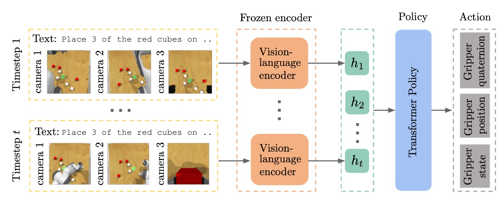

# InstructRL

This is a Jax implementation for the *Instruct*RL method.

Paper: [Instruction-Following Agents with Jointly Pre-Trained Vision-Language Models](https://arxiv.org/abs/2210.13431).



This implementation has been tested on GPU and Google Cloud TPU and supports multi-host training with TPU Pods.

The code supports the following methods and baselines
- From scratch: Training transformer policy from scratch w/ and w/o instructions.
- CLIP-RL: Training transformer policy with pretrained OpenAI CLIP-VIT w/ and w/o instructions.
- *Instruct*RL: Training transformer policy with pretrained multimodal MAE encoding w/ and w/o instructions.

The code also supports training and evaluating with both continuous and discretized robot action.

## Installation
If this is on GPU, install CoppeliaSim with [coppeliasim script](./scripts/coppeliasim.sh), then install the dependencies with pip.
```
cat gpu_requirements.txt | xargs -n 1 -L 1 pip install
```

If this is on TPU, install the dependencies using the [TPU setup script](./scripts/tpu_vm_setup.sh).
After installing dependencies, add this repo directory to your `PYTHONPATH` environment variable
```
export PYTHONPATH="$PYTHONPATH:$(pwd)"
```

## Usage
Experiments can be launched via the following commands.

Training a policy transformer using pretrained multimodal MAE encoding
```
export PYTHONPATH="$PYTHONPATH:$PROJECT_DIR"
export PYTHONPATH="$PYTHONPATH:$PROJECT_DIR/instructrl/models"
echo $PYTHONPATH
export WANDB_API_KEY=''

export bucket_name='instruct-rl'

export experiment_name='instructrl'

ONLINE=True
DATASET="reach_target"
MODEL_TYPE="vit_base"
TRANSFER_TYPE="m3ae_vit_b16"
BATCH_SIZE=2048
INSTRUCTION="moving to one of the spheres"
NOTE="pt: $TRANSFER_TYPE inst: $INSTRUCTION batch size: $BATCH_SIZE policy: $MODEL_TYPE dataset: $DATASET"

python3 -m instructrl.instructrl_main \
    --is_tpu=True \
    --dataset_name="$DATASET" \
    --model.model_type="$MODEL_TYPE" \
    --model.transfer_type="$TRANSFER_TYPE" \
    --window_size=4 \
    --val_every_epochs=1 \
    --test_every_epochs=1 \
    --instruct="$INSTRUCTION" \
    --batch_size="$BATCH_SIZE" \
    --weight_decay=0.0 \
    --lr=3e-4 \
    --auto_scale_lr=False \
    --lr_schedule=cos \
    --warmup_epochs=5 \
    --momentum=0.9 \
    --clip_gradient=10.0 \
    --epochs=200 \
    --dataloader_n_workers=16 \
    --dataloader_shuffle=False \
    --log_all_worker=False \
    --logging.online="$ONLINE" \
    --logging.prefix='' \
    --logging.project="$experiment_name" \
    --logging.gcs_output_dir="gs://$bucket_name/instructrl/experiment_output/$experiment_name" \
    --logging.output_dir="$HOME/experiment_output/$experiment_name" \
    --logging.random_delay=0.0 \
    --logging.notes="$NOTE"
```

The *model.transfer_type* argument determines pretrained transformers, with the following options supported
- VIT training from scratch "None"
- M3AE pretrained model "m3ae_vit_b16" (with larger models coming soon)
- CLIP pretrained model "clip_vit_b32" and "clip_vit_b16"

The *model.model_type* argument determines the type of trained from scratch policy transformer, it can be one of vit_small, vit_base, and vit_large.

For large-scale training (e.g. training on near 100 tasks), it is recommended to use large TPU pod.
We provide the job script for launching large-scale training in [jobs](./jobs/tpu_control.sh).

Evaluating trained model
```
export PYTHONPATH="$PYTHONPATH:$PROJECT_DIR"
export PYTHONPATH="$PYTHONPATH:$PROJECT_DIR/instructrl/models"
echo $PYTHONPATH
export WANDB_API_KEY=''

export bucket_name='instruct-rl'

export experiment_name='instructrl'

ONLINE=True
DATASET="reach_target"
MODEL_TYPE="vit_base"
TRANSFER_TYPE="m3ae_vit_b16"
INSTRUCTION="moving to one of the spheres"
CKPT=""
NOTE="Local rollout. pt: $TRANSFER_TYPE inst: $INSTRUCTION policy: $MODEL_TYPE dataset: $DATASET"

python3 -m instructrl.local_run \
    --load_checkpoint "$CKPT" \
    --dataset_name="$DATASET" \
    --model.model_type="$MODEL_TYPE" \
    --model.transfer_type="$TRANSFER_TYPE" \
    --window_size=1 \
    --instruct="$INSTRUCTION" \
    --log_all_worker=False \
    --data.path="$PROJECT_DIR/data/variation" \
    --logging.online="$ONLINE" \
    --logging.prefix='' \
    --logging.project="$experiment_name" \
    --logging.gcs_output_dir="gs://$bucket_name/instructrl/experiment_output/$experiment_name" \
    --logging.output_dir="$HOME/experiment_output/$experiment_name" \
    --logging.random_delay=0.0 \
    --logging.notes="$NOTE"
```

## Data generation
Our preprocessed single-task and multi-task data will be released soon.
In order to facilitate large scale training on cloud, we store all the dataset
as HDF5 files and read them from cloud storage buckets.
The HDF5 data contains images, states and actions.
An example of data generation can be found in [collect_data script](./data/collect_data.py).

## Acknowledgement
The Multimodal MAE implementation is largely based on [m3ae](https://github.com/young-geng/m3ae_public) and the CLIP implementation is largely based on [scenic](https://github.com/google-research/scenic/tree/main/scenic/projects/baselines/clip).
